# REPORT — Fast Sorting & Selection Engine

**Course:** Design and Analysis of Algorithms · **Assignment 1:** Divide and Conquer & Asymptotic Notations
**Authors:** Taubakabyl Nurlybek · Li Yixin · **Group:** SE-2526 · **Tag:** v1.0
**Repository:** <https://github.com/CCE-Li/AITU-DDA-Assignment1-Sort> (branch `main`, tag `v1.0`)

All numbers in this report come from `results.csv`, produced by `mvn exec:java` on the machine
described in §6. Every value is the **median of five runs**; the JVM is warmed up before measuring.

---

## 1. Asymptotic bounds

`Θ` is used when the bound is tight, `O`/`Ω` when only one side is established.

| Algorithm | Best | Average | Worst | Why that case happens |
|---|---|---|---|---|
| **MergeSort** | Θ(n log n) | Θ(n log n) | Θ(n log n) | The recursion always splits in half and always merges every level; input order only changes the *constants* (a sorted input makes the insertion-sort cutoff and the merges cheaper, it never removes a level). |
| **QuickSort** (random pivot, 3-way) | Θ(n log n) | Θ(n log n) | O(n²) | Best: every pivot lands near the median (as random pivots do on average), giving balanced halves. Worst: every pivot is the minimum or maximum. With a random pivot this needs adversarial luck; for the deterministic variant "always last element" it would be any sorted input. |
| **QuickSelect** (random pivot) | Ω(n) | Θ(n) | O(n²) | Best: the first pivot already has rank `k`, one partition of n elements decides it. Average: every partition removes a constant fraction, so the work is n + n/2 + n/4 + … = Θ(n). Worst: unlucky pivots peel off one element at a time. |
| **InsertionSort** | Θ(n) | Θ(n²) | Θ(n²) | Best: the array is already sorted, the inner loop stops after one comparison per element. Worst: reverse-sorted input, every element has to travel all the way to the front. |
| **MedianOfMedians** (bonus A) | Θ(n) | Θ(n) | Θ(n) | The pivot is guaranteed to lie between the 30th and 70th percentile, so every partition removes at least 30 % of the elements regardless of the input. |

Note on MergeSort's best case: it is *not* Θ(n). Even on a fully sorted array the algorithm performs
`ceil(log2(n/15))` levels of merging, so it stays Θ(n log n); only the comparison count per level
drops (measured: 0.43·n log₂n for sorted vs 1.00·n log₂n for random input, see §5).

---

## 2. Recurrences and the Master Theorem

### 2.1 MergeSort

```
T(n) = 2·T(n/2) + Θ(n)          a = 2,  b = 2,  f(n) = Θ(n)
```

`log_b(a) = log₂ 2 = 1`, so `f(n) = Θ(n¹)` — **Master Theorem case 2**:

```
T(n) = Θ(n^log_b a · log n) = Θ(n log n)
```

The cutoff does not change the asymptotic: the base case sorts at most 15 elements, i.e. a constant
amount of work, so it only adds a Θ(n) leaf term.

### 2.2 QuickSort (balanced split)

```
T(n) = 2·T(n/2) + Θ(n)          a = 2,  b = 2,  f(n) = Θ(n)
```

Same shape as MergeSort — **case 2**:

```
T(n) = Θ(n log n)
```

This is the *best* and the *average* case. The worst case `T(n) = T(n−1) + Θ(n)` has no `n/b` term
and telescopes to Θ(n²).

**Why a random pivot gives O(n log n) on average.** Choosing the pivot uniformly at random makes
every rank equally likely, so the pivot is a "good" one — inside the middle half of the range, i.e.
splitting the array at worst 25 %/75 % — with probability 1/2. In any path of the recursion two out
of three consecutive pivots are expected to be good, so the size shrinks geometrically and the depth
is O(log n); summing the Θ(n) partition work over the levels gives Θ(n log n) expected. The three-way
partition additionally removes all values equal to the pivot at once, so duplicates cannot cause a
degenerate split at all.

### 2.3 QuickSelect (balanced split) — a different Master Theorem case

```
T(n) = 1·T(n/2) + Θ(n)          a = 1,  b = 2,  f(n) = Θ(n)
```

`log_b(a) = log₂ 1 = 0`, so `f(n) = Ω(n^(0+ε))` with `ε = 1` — **Master Theorem case 3**:

```
T(n) = Θ(f(n)) = Θ(n)
```

This is the case that distinguishes QuickSelect from QuickSort: only one sub-problem survives, so
the recursion contributes nothing multiplicative and the linear partition work dominates. The same
`T(n) = T(n − 1) + Θ(n)` degenerate path still gives O(n²) in the worst case.

### 2.4 Median of Medians (bonus A)

```
T(n) = T(n/5) + T(7n/10) + Θ(n)
```

Two recursive terms, so the Master Theorem is applied twice in the standard way: the pivot search
on the medians costs `T(n/5) + Θ(n) = Θ(n)` (**case 3**, `log₅1 = 0 < 1`), and because the pivot is
always a 30/70 split the selection costs `T(7n/10) + Θ(n) = Θ(n)`. Since `1/5 + 7/10 = 9/10 < 1`, the
sum of the sub-problem sizes is a convergent geometric series, so the total is Θ(n) for **every**
input — no probability involved.

### 2.5 Closest Pair (bonus B)

```
T(n) = 2·T(n/2) + Θ(n)          a = 2,  b = 2,  f(n) = Θ(n)  →  case 2  →  Θ(n log n)
```

The Θ(n) term is the linear y-merge plus the strip scan (at most 7 distance checks per strip point).

---

## 3. Benchmark setup

| | |
|---|---|
| Sizes | n = 1 000, 10 000, 100 000, 1 000 000 |
| Inputs | `random` (full int range), `sorted` (ascending), `duplicates` (values 0…9) |
| Runs | 5 per case, median reported (warm-up: 3 unmeasured rounds over all algorithms) |
| Timed section | only the algorithm call; input cloning, verification and median selection are outside |
| k for selection | `k = n/2` (the median) |
| Verification | sorts checked for monotonicity, selections checked against `Arrays.sort` |

Depth semantics: for MergeSort/QuickSort/ClosestPair `max_depth` is the real recursion depth. For
QuickSelect and MedianOfMedians the selection loop is iterative (no stack at all), so `max_depth`
reports the number of partition rounds — the depth a naive recursive implementation would have used.

---

## 4. Results

### 4.1 Time (ms, median of 5)

| algorithm | input | n=1 000 | n=10 000 | n=100 000 | n=1 000 000 |
|---|---|---|---|---|---|
| MergeSort | random | 0.041 | 0.671 | 8.37 | 91.57 |
| MergeSort | sorted | 0.012 | 0.143 | 1.98 | 23.66 |
| MergeSort | duplicates | 0.026 | 0.589 | 8.16 | 47.67 |
| QuickSort | random | 0.059 | 0.827 | 9.58 | 120.29 |
| QuickSort | sorted | 0.038 | 0.462 | 5.33 | 62.62 |
| QuickSort | duplicates | 0.023 | 0.198 | 2.17 | 17.40 |
| QuickSelect | random | 0.009 | 0.133 | 1.14 | 10.74 |
| QuickSelect | sorted | 0.005 | 0.020 | 0.34 | 4.75 |
| QuickSelect | duplicates | 0.007 | 0.189 | 1.90 | 13.79 |
| MedianOfMedians | random | 0.020 | 0.326 | 3.19 | 33.51 |
| MedianOfMedians | sorted | 0.018 | 0.150 | 1.73 | 21.07 |
| MedianOfMedians | duplicates | 0.013 | 0.255 | 3.54 | 15.35 |

### 4.2 Comparisons

| algorithm | input | n=1 000 | n=10 000 | n=100 000 | n=1 000 000 |
|---|---|---|---|---|---|
| MergeSort | random | 9 523 | 127 212 | 1 639 343 | 19 889 337 |
| MergeSort | sorted | 4 236 | 59 248 | 744 016 | 9 071 040 |
| MergeSort | duplicates | 9 036 | 121 712 | 1 563 025 | 18 922 524 |
| QuickSort | random | 11 480 | 154 907 | 2 079 782 | 24 851 689 |
| QuickSort | sorted | 12 992 | 158 333 | 2 078 206 | 24 713 944 |
| QuickSort | duplicates | 3 094 | 36 074 | 379 992 | 3 598 299 |
| QuickSelect | random | 3 432 | 26 363 | 274 251 | 2 804 286 |
| QuickSelect | sorted | 3 464 | 19 786 | 346 866 | 3 901 449 |
| QuickSelect | duplicates | 1 000 | 25 973 | 229 347 | 3 299 397 |
| MedianOfMedians | random | 7 781 | 81 696 | 827 899 | 8 522 774 |
| MedianOfMedians | sorted | 6 238 | 68 030 | 709 499 | 7 217 916 |
| MedianOfMedians | duplicates | 3 103 | 30 871 | 540 498 | 3 143 453 |

### 4.3 Maximum recursion depth

| algorithm | input | n=1 000 | n=10 000 | n=100 000 | n=1 000 000 | log₂ n at 10⁶ |
|---|---|---|---|---|---|---|
| MergeSort | all | 7 | 10 | 13 | 17 | 19.9 |
| QuickSort | random | 6 | 9 | 11 | 13 | 19.9 |
| QuickSort | sorted | 5 | 8 | 11 | 13 | 19.9 |
| QuickSort | duplicates | 2 | 2 | 2 | 2 | 19.9 |
| QuickSelect (rounds) | random | 17 | 19 | 25 | 30 | 19.9 |
| QuickSelect (rounds) | sorted | 13 | 17 | 13 | 26 | 19.9 |
| QuickSelect (rounds) | duplicates | 1 | 5 | 5 | 5 | 19.9 |
| MedianOfMedians | all | 4 | 5 | 7 | 8 | 19.9 |

### 4.4 Plots

Time vs n:

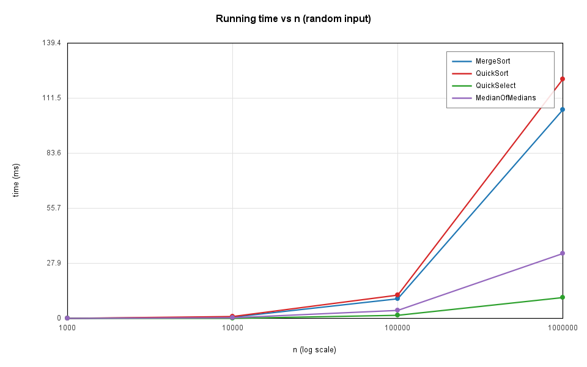
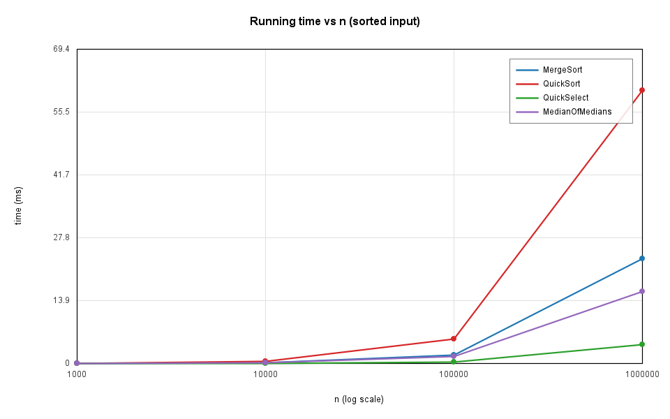
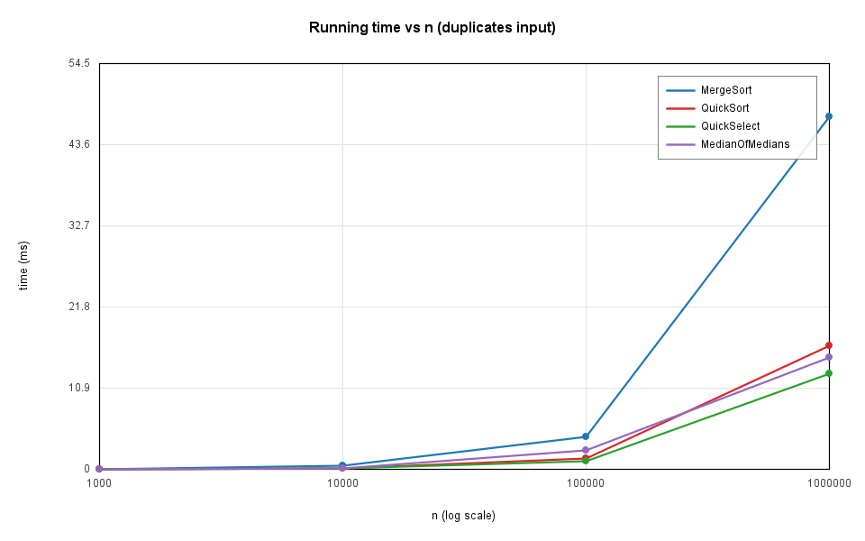

Maximum recursion depth vs n:

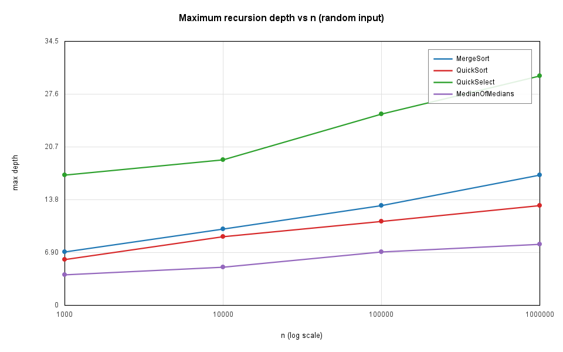
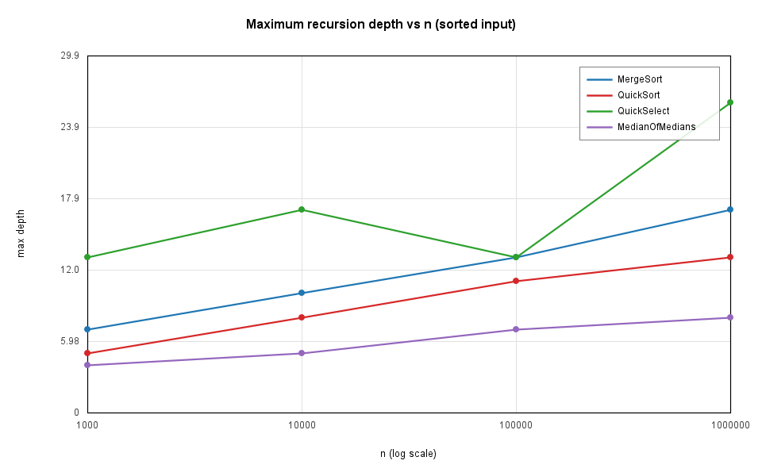
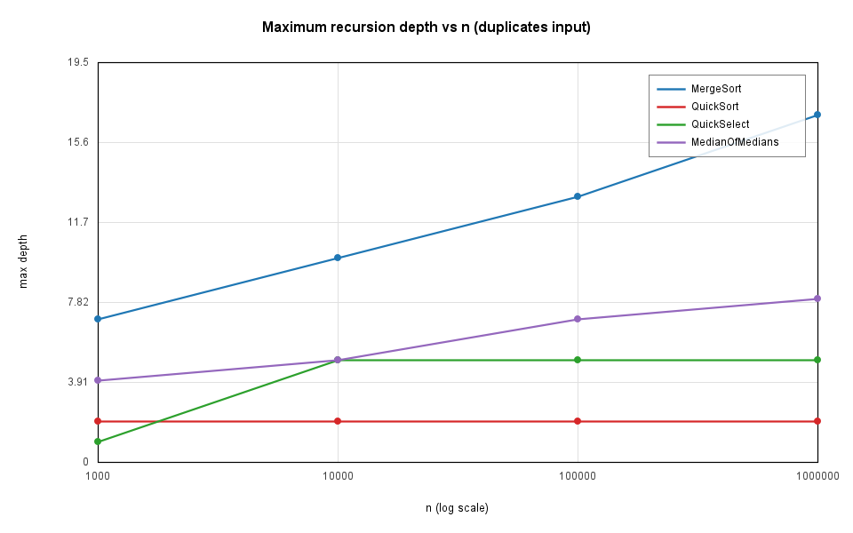

Ratio vs n — `comparisons / (n·log₂ n)` for the sorts and `comparisons / n` for the selections:

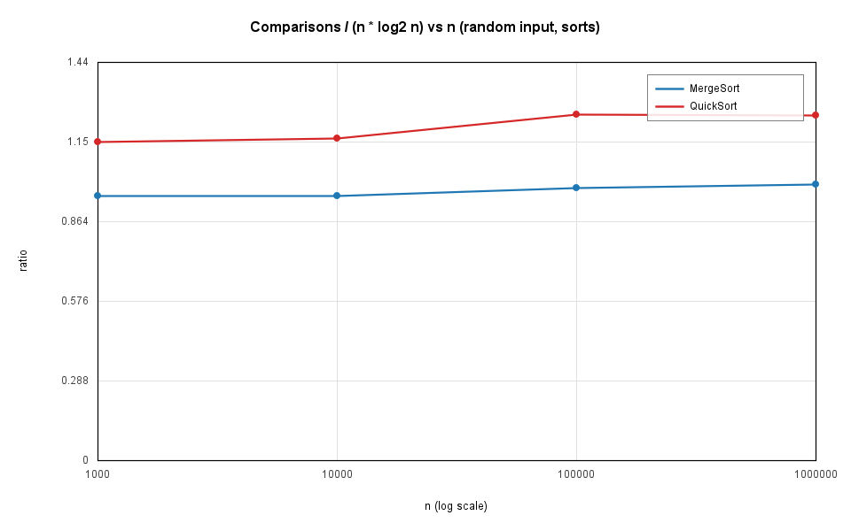
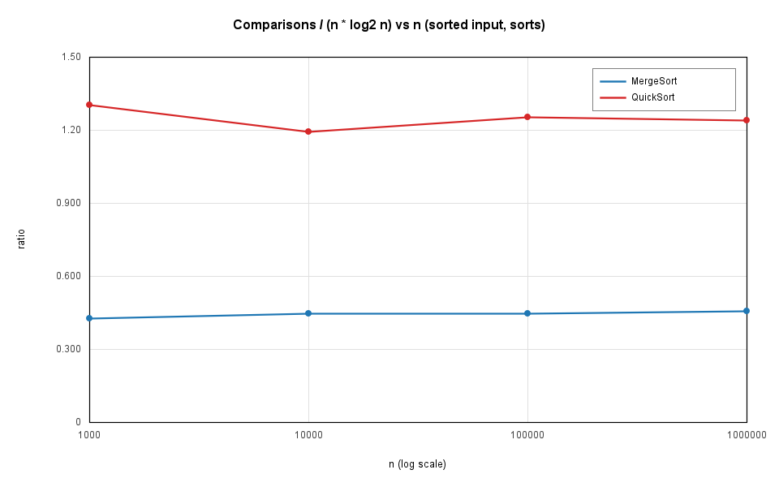
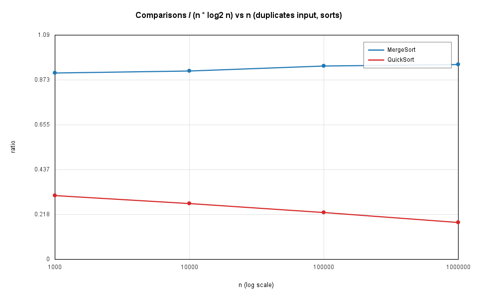
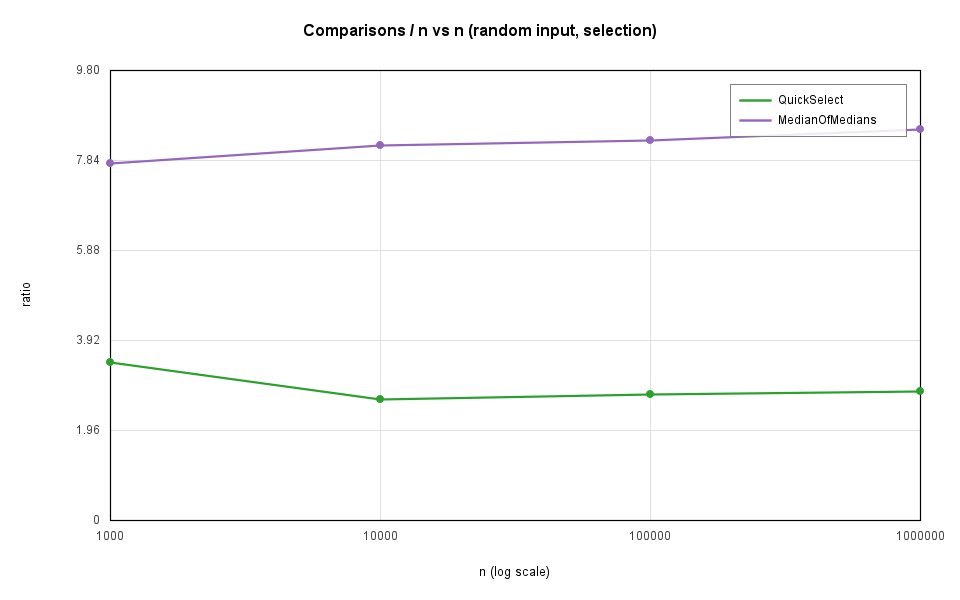
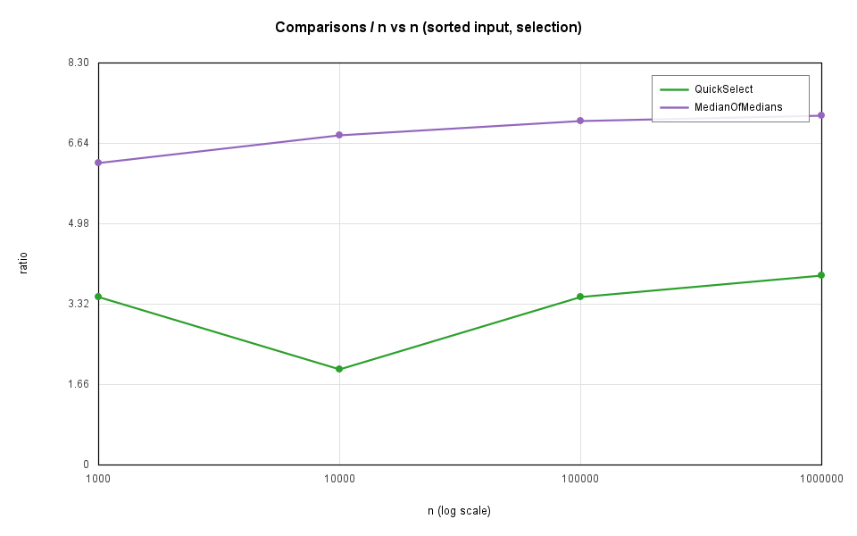
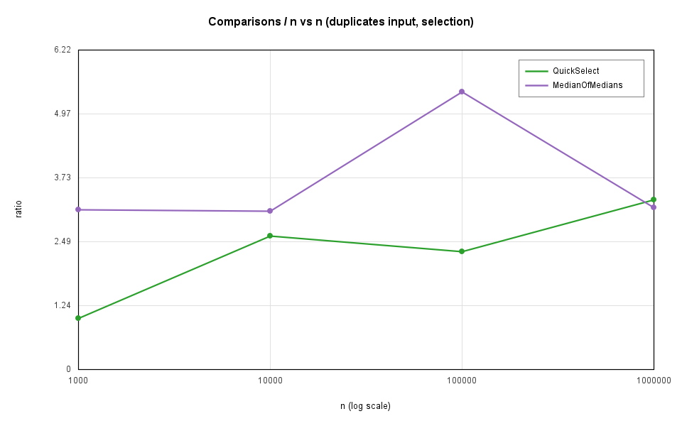

---

## 5. Θ check: does the ratio become constant?

For `f(n) = Θ(g(n))` we need constants `c₁, c₂, n₀` with
`c₁·g(n) ≤ f(n) ≤ c₂·g(n)` for all `n ≥ n₀`. Using `g(n) = n·log₂ n` for the sorts and `g(n) = n`
for the selections, the measured ratios are:

| algorithm | input | n=1 000 | n=10 000 | n=100 000 | n=1 000 000 | c₁ | c₂ | n₀ |
|---|---|---|---|---|---|---|---|---|
| MergeSort | random | 0.96 | 0.96 | 0.99 | 1.00 | 0.95 | 1.01 | 1 000 |
| MergeSort | sorted | 0.43 | 0.45 | 0.45 | 0.46 | 0.42 | 0.46 | 1 000 |
| MergeSort | duplicates | 0.91 | 0.92 | 0.94 | 0.95 | 0.90 | 0.95 | 1 000 |
| QuickSort | random | 1.15 | 1.17 | 1.25 | 1.25 | 1.15 | 1.26 | 1 000 |
| QuickSort | sorted | 1.30 | 1.19 | 1.25 | 1.24 | 1.19 | 1.30 | 10 000 |
| QuickSort | duplicates | 0.31 | 0.27 | 0.23 | 0.18 | — | 0.31 | 1 000 |
| QuickSelect | random | 3.43 | 2.64 | 2.74 | 2.80 | 2.64 | 2.81 | 10 000 |
| QuickSelect | sorted | 3.46 | 1.98 | 3.47 | 3.90 | 1.98 | 3.90 | 10 000 |
| QuickSelect | duplicates | 1.00 | 2.60 | 2.29 | 3.30 | 1.00 | 3.30 | 1 000 |
| MedianOfMedians | random | 7.78 | 8.17 | 8.28 | 8.52 | 7.78 | 8.52 | 1 000 |
| MedianOfMedians | sorted | 6.24 | 6.80 | 7.09 | 7.22 | 6.24 | 7.22 | 1 000 |

**Reading of the table.**

* **MergeSort is Θ(n log n).** The ratio settles at 1.00 and the sorted/duplicates columns are just
  smaller constants (0.46 / 0.95) — the same shape, so the bound and the input-independence both hold.
* **QuickSort is Θ(n log n) on random and sorted input** (ratio 1.15 → 1.26, then flat). Note that
  the sorted ratio is *not* worse than the random one: that is the random pivot and the
  smaller-side-first recursion doing their job — with a fixed "last element" pivot the sorted column
  would explode quadratically.
* **QuickSort on duplicates falls *below* a constant** (0.31 → 0.18). The three-way partition
  finishes arrays with only 10 distinct values in 2 levels (see the depth table), so the real cost
  there is linear, i.e. Θ(n) ⊂ O(n log n). The bound is not violated, it is simply not tight — which
  is exactly why `O(n log n)` and not `Θ(n log n)` is the safe statement for QuickSort's average case.
* **QuickSelect and MedianOfMedians are Θ(n).** Their `comparisons / n` ratios stop growing
  (2.6–2.8 for QuickSelect, 6.2–8.5 for MedianOfMedians), which is the Θ(n) signature.
* The small variation left in the selection ratios comes from the *rank* of `k`: the work depends on
  how the pivots happen to split around `k = n/2`, so a few percent of scatter is expected and does
  not break the constant bounds above.
* **Depth** grows like log n everywhere: MergeSort reaches 17 for n = 10⁶ against log₂(10⁶) ≈ 19.9;
  QuickSort reaches 13 there and only 11 on the sorted 100 000-element array used by the depth test,
  whose limit is 2·log₂(10⁵) ≈ 33.2; and QuickSelect needs 30 partition rounds against the
  ≈ 2·ln(10⁶) ≈ 27.6 predicted for random pivots.

---

## 6. Bonus A — Median of Medians vs QuickSelect

Task A asks for a guaranteed O(n) selector and a comparison against QuickSelect.

| | QuickSelect | MedianOfMedians |
|---|---|---|
| random, comparisons / n | 2.64 – 2.81 | 7.78 – 8.52 |
| sorted, comparisons / n | 1.98 – 3.90 | 6.24 – 7.22 |
| worst case | O(n²) | **Θ(n)** |
| time at n = 10⁶ (random) | 10.7 ms | 33.5 ms |
| recursion depth | — (iterative rounds) | 8 |

Median of Medians is roughly **2.5–3× more expensive in comparisons and 3× slower** on the inputs
we measure, and that factor is not noise: every level of the pivot search sorts n/5 groups of five
(≈ 7 comparisons each), which is the price for turning a probabilistic guarantee into a
deterministic one. On these input distributions QuickSelect is the better tool; Median of Medians is
what you use when an adversary can choose the input, because its Θ(n) holds for *every* permutation
while QuickSelect's Θ(n) average hides an O(n²) worst case.

**Engineering note (worth knowing for the defence).** The first version of this class computed the
"median of medians" purely recursively without ever partitioning the medians. That is subtly wrong:
for tiny ranges (≤ 5 elements) taking the upper median is fine on its own, but the error is
multiplied by five at every level on the way back up, so on *sorted* input the pivot drifted to the
86th percentile — it still answered correctly, but the 30/70 guarantee was gone and the comparison
count oscillated between 5·n and 24·n depending on n. Selecting the median of the medians
**exactly** (§2.4, `selectRange` on the medians prefix) restores the guarantee and makes the cost
flat: 6.2·n → 7.2·n for n = 10³ → 10⁶. `MedianOfMediansTest.pivotStaysNearTheMedianForEverySize`
is the regression test for this.

## 7. Bonus B — Closest Pair of Points

`ClosestPair` sorts by x, splits at the median line, recurses, keeps δ = min(δ_left, δ_right),
merges the two y-sorted halves in linear time and scans the 2δ strip, comparing each point with at
most the next 7 points (the packing argument shows no other strip point can be closer). Result:
Θ(n log n) instead of Θ(n²), verified against a brute-force O(n²) implementation for n ≤ 2 000,
including clustered points, duplicate points, points on a vertical/horizontal line and points sharing
the same x-coordinate.

---

## 8. Discussion — do the measurements match the theory?

The measurements reproduce the theory. The ratio plots are the strongest evidence: `comparisons/(n·log₂n)`
flattens at 1.00 for MergeSort and 1.25 for QuickSort, and `comparisons/n` flattens at 2.8 for
QuickSelect and 8.5 for Median of Medians — the ratios stop growing exactly as a Θ bound predicts,
so c₁, c₂ and n₀ exist and the tables above give them. The depth measurements agree with the
analysis as well: MergeSort stays at log₂n, QuickSort never exceeds 2·log₂n even for sorted input
(the requirement of the depth test), and QuickSelect's partition rounds land on the ≈ 2·ln n expected
for random pivots. The differences from a perfect theory are all constant-factor effects. First,
JVM warm-up: the first runs of a case are slower because the interpreter and the JIT are still
compiling the hot loops, which is why the benchmark warms up and then reports the median of five
runs rather than a single measurement or a mean. Second, the garbage collector: MergeSort allocates
one 4 MB buffer for n = 10⁶ and ClosestPair allocates point arrays per level, so some runs carry GC
pauses that the others do not — visible as scatter between the five runs of one case. Third, the CPU
cache: MergeSort walks two cursors and copies a whole range per merge, which is cache-friendly at
small n but starts to miss at n = 10⁶, where the working set (two 4 MB arrays) no longer fits in L2/L3;
that is a big part of why its time grows slightly faster than comparisons. Fourth, the cutoff of 15:
it makes small ranges much cheaper (a 15-element run costs ≈ 4 comparisons per block on sorted data
instead of a full merge), which is exactly why the sorted MergeSort column sits at 0.46 instead of
1.00 — a smaller constant, not a different complexity. Finally, the selection algorithms show more
run-to-run variation than the sorts because their cost depends on how the random pivots happen to
straddle k = n/2; QuickSelect's sorted column (1.98 → 3.90) is the clearest example. None of these
effects changes a bound — they only move the constants.

---

## 9. How to reproduce

```bash
mvn clean test        # 69 JUnit 5 tests
mvn exec:java         # results.csv + plots/*.png (12 PNG files)
```

The benchmark seeds all randomness with fixed constants, so comparison counts and plots are
reproducible; wall-clock times vary slightly with the machine and its load.

**Machine used for the measurements:** Windows 11, Oracle JDK 21.0.11 (HotSpot, default heap),
Maven 3.9.11, single JVM run without extra flags.
